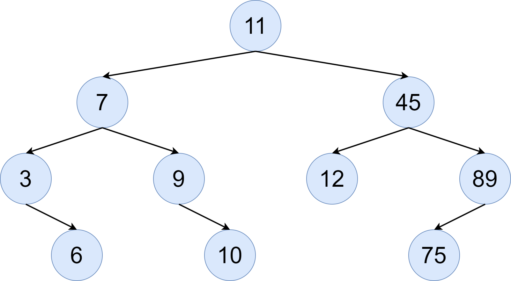

# Aufgabenblatt 4

## Aufgabe 1: Tree Traversal

```csharp
class BinaryTreeNode {
    public int Value { get; set; }

    public BinaryTreeNode LeftChild { get; set; }
    public BinaryTreeNode RightChild { get; set; }

    public void PrintDepthFirstPreOrder() {
        // Handle value.
        Console.Write($"{this.Value}, ");

        // Handle children.
        if (this.LeftChild != null) {
            this.LeftChild.PrintDepthFirstPreOrder();
        }

        if (this.RightChild != null) {
            this.RightChild.PrintDepthFirstPreOrder();
        }
    }

    public void PrintDepthFirstInOrder() {
        // Handle left child.
        if (this.LeftChild != null) {
            this.LeftChild.PrintDepthFirstInOrder();
        }

        // Handle value.
        Console.Write($"{this.Value}, ");

        // Handle right child.
        if (this.RightChild != null) {
            this.RightChild.PrintDepthFirstInOrder();
        }
    }

    public void PrintDepthFirstPostOrder() {
        // Handle children.
        if (this.LeftChild != null) {
            this.LeftChild.PrintDepthFirstPostOrder();
        }

        if (this.RightChild != null) {
            this.RightChild.PrintDepthFirstPostOrder();
        }

        // Handle value.
        Console.Write($"{this.Value}, ");
    }
}
class BinaryTree {
    public BinaryTreeNode Root { get; set; }

    public void PrintDepthFirstPreOrder() {
        // Do nothing if the tree is empty.
        if (this.Root == null) {
            return;
        }

        // Recurse.
        this.Root.PrintDepthFirstPreOrder();
    }

    public void PrintDepthFirstInOrder() {
        // Do nothing if the tree is empty.
        if (this.Root == null) {
            return;
        }

        // Recurse.
        this.Root.PrintDepthFirstInOrder();
    }

    public void PrintDepthFirstPostOrder() {
        // Do nothing if the tree is empty.
        if (this.Root == null) {
            return;
        }

        // Recurse.
        this.Root.PrintDepthFirstPostOrder();
    }
}


// Hauptklasse zur Durchführung von Tests
public class Program {
    static void Main(string[] args) {
        var tree = new BinaryTree() {
            Root = new BinaryTreeNode() {
                Value = 10,
                LeftChild = new BinaryTreeNode() {
                    Value = 17,
                    LeftChild = new BinaryTreeNode() {
                        Value = 8,
                        RightChild = new BinaryTreeNode() { 
                            Value = 10
                        }
                    },
                    RightChild = new BinaryTreeNode() { 
                        Value = 11
                    }
                },
                RightChild = new BinaryTreeNode() { 
                    Value = 9,
                    LeftChild = new BinaryTreeNode() { 
                        Value = 18
                    },
                    RightChild = new BinaryTreeNode() {
                        Value = 19
                    }
                }
            }
        };

        tree.PrintDepthFirstPreOrder();
        Console.WriteLine();

        tree.PrintDepthFirstInOrder();
        Console.WriteLine();

        tree.PrintDepthFirstPostOrder();
        Console.WriteLine();
    }
}
```

## Aufgabe 2: Expression Trees

```csharp
using System.Globalization;

abstract class Expression {
    public abstract double GetValue();
    public abstract override string ToString();
}

class LiteralValue : Expression {
    public double Value { get; set; }

    public LiteralValue(double value) { 
        this.Value = value; 
    }

    public override double GetValue() {
        return this.Value;
    }

    public override string ToString() {
        return this.Value.ToString(CultureInfo.InvariantCulture);
    }
}

class Multiplication : Expression {
    public Expression Left { get; set; }
    public Expression Right { get; set; }

    public Multiplication(Expression left, Expression right) {
        this.Left = left;
        this.Right = right;
    }

    public override double GetValue() {
        return this.Left.GetValue() * this.Right.GetValue();
    }

    public override string ToString() {
        return $"({this.Left} * {this.Right})";
    }
}

class Addition : Expression {
    public Expression Left { get; set; }
    public Expression Right { get; set; }

    public Addition(Expression left, Expression right) {
        this.Left = left;
        this.Right = right;
    }

    public override double GetValue() {
        return this.Left.GetValue() + this.Right.GetValue();
    }

    public override string ToString() {
        return $"({this.Left} + {this.Right})";
    }
}

// Hauptklasse zur Durchführung von Tests
class Program {
    static void Main(string[] args) {
        Expression exp = new Addition(
            new Multiplication(
                new LiteralValue(5.5),
                new Addition(
                    new LiteralValue(7.0),
                    new LiteralValue(11.3)
                )
            ),
            new Addition(
                new LiteralValue(3.7),
                new LiteralValue(9.0)
            )
        );

        // Should print True.
        Console.WriteLine(exp.GetValue() == ((5.5 * (7 + 11.3)) + (3.7 + 9)));

        // Should print True.
        Console.WriteLine(exp.ToString() == "((5.5 * (7 + 11.3)) + (3.7 + 9))");

        // Should print ((5.5 * (7 + 11.3)) + (3.7 + 9)) = 113.35000000000001
        Console.WriteLine($"{exp} = {exp.GetValue()}");
    }
}
```

## Aufgabe 3: Binary Search Tree

Der fertige Baum sieht wie folgt aus:


